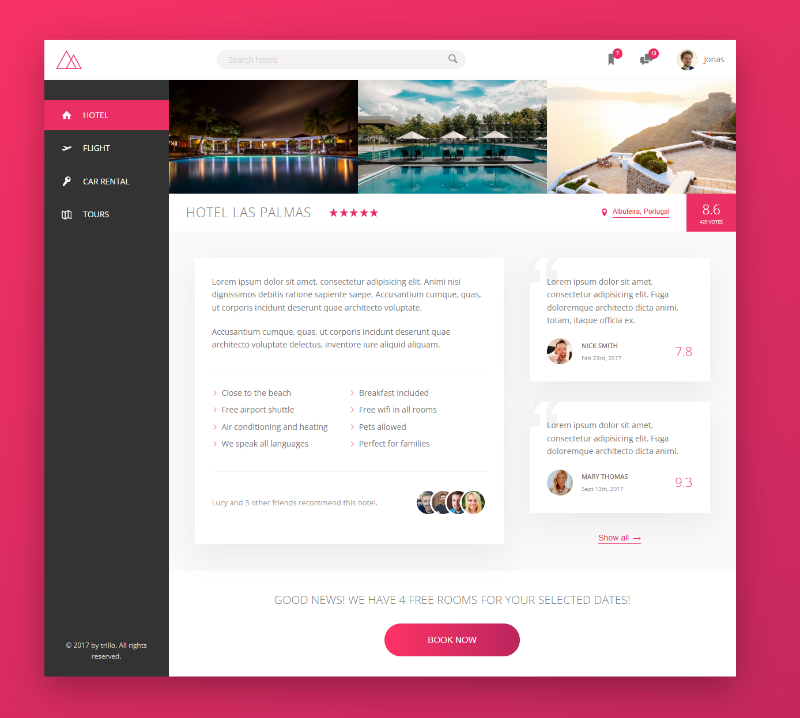

# Trillo

The main goal of this project was to build a responsive landing page by using the Flexbox CSS layout method. 
Besides flexbox, the course covers the usage of SVG icons, BEM methodology, CSS variables, animations and transitions as well as responsive design, some handy CSS tricks and helpful online tools.

### Visit the website here [Trillo](https://trillo-mz.vercel.app/).

## Preview

## Technologies Used

- HTML
- SASS / CSS

_This project is a part of udemy course taught by Jonas Schmedtmann for educational purposes._